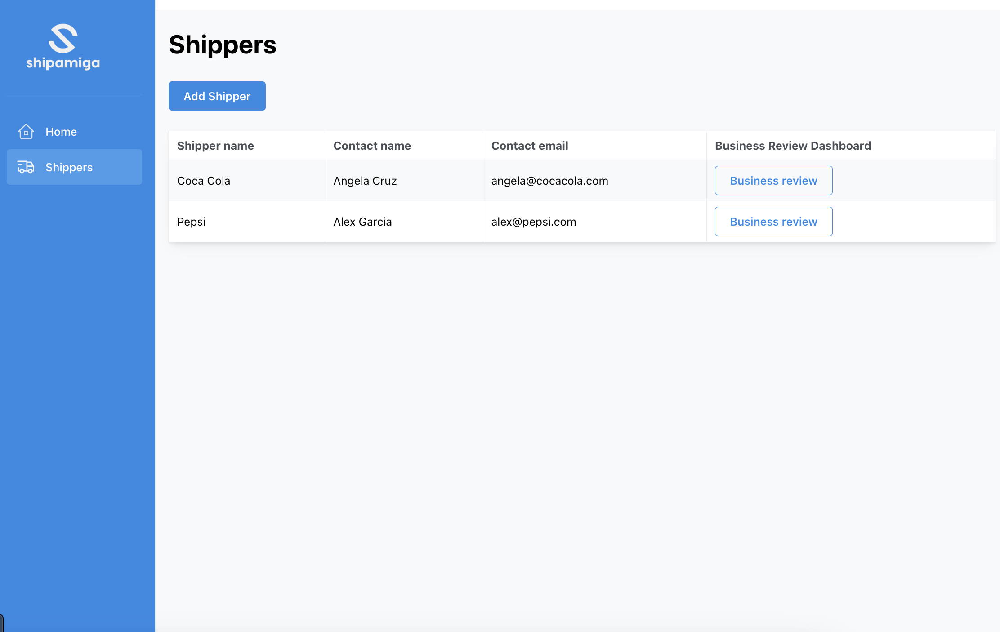
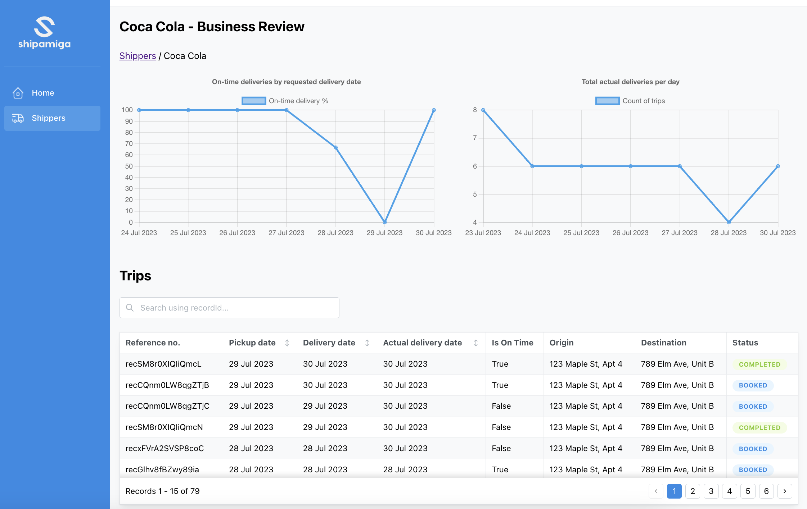
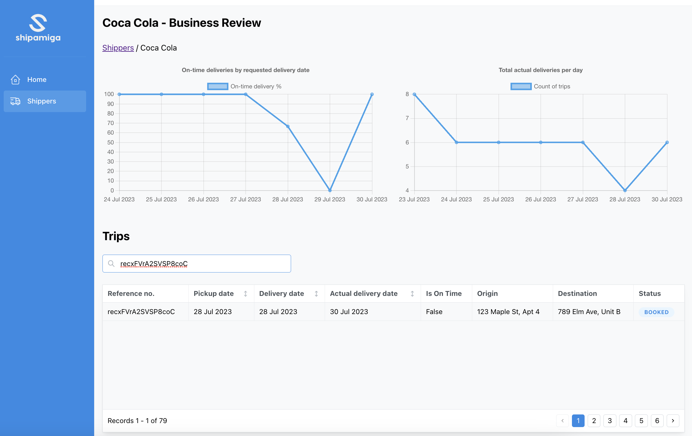

# Shipper Data Dashboard

An operational business review dashboard built for a logistics start-up that seeks to modernise freight operations for third-party logistics (3PL) companies.

The goal of this dashboard is to enable 3PLs to conduct business reviews with their shippers, demonstrate performance, and get more trips. This dashboard saves 3PLs weeks of effort to prepare for such reviews by automatically generating data and charts needed for the business reviews.

This game was developed as part of my coursework for my Software Engineering Immersive Bootcamp in General Assembly.

# Screenshots

Shipper Overview - View all your shippers in one page

3PL users can use shipper-specific data dashboard to run business reviews with their Shippers

# Technologies Used

- JavaScript
- Front-end library: React.js
- React component library: Mantine
- Charting library: Chart.js
- Database: Airtable

# Demo site

- Todo: Add deployment URL

# Version History

- [v1.0.0][1] - First version

[1]: ...

# Next Steps

- More charts

# Credits and references

- [Client Demo site][5]
- [Navbar reference][6] - To create pixel art
- [Airtable URL encoder][7] - Reference for airtable endpoint

  [5]: https://dashboard.shipamiga.com/dashboard/recja2ANzmll7wqR5
  [6]: https://ui.mantine.dev/category/navbars#double-navbar
  [7]: https://codepen.io/airtable/full/MeXqOg?baseId=appPYAMvKJeeoDs8Y&tableId=tblghPYVFfkEZRIOE

# Changelog

## 31 Jul 2023

1. Create readme - done
2. Basic website layout using mantine - done
3. Build Shipper and business review pages - done
4. Add routes - done
5. Add shipper-specific routes - done
6. Set up trips data in airtable - done
7. Fetch trips data of shipper and display in shipper biz dashboard - done
8. Show trips data in table - done

## 1 Aug 2023

1. Use fetch method to retrieve data - done
2. Add lifting state - done
3. Add chart 1 - done

- build isOnTime logic - done
- use chart.js for charts - done

4. Add chart 2 - done
5. Charts improvements - seed more dummy data, set range to 5 days - done
6. Table improvements - use Mantine datatable, add pagination - done

MVP Complete

## 2 Aug 2023

1. Move API url and key to env - done
2. Add search functionality to table - done
3. Daily Delivery Chart: Update Y-axis to no decimal pts - done
4. Table: Format status - done
5. Debug issues

- Table: filter by actual delivery date
- Table: Add sort by dates
- Table: User should be able to search entire dataset, not just within the page
- Chart: X-axis should have specific date intervals, even if there are no data points for some dates

## Next steps

Stretch goals

- Write unit tests
- Use D3 for charts
