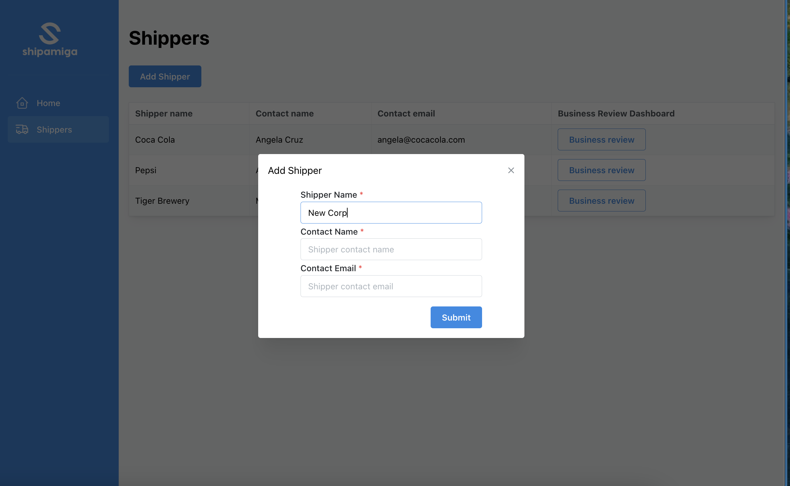

# Shipper Data Dashboard

An operational business review dashboard built for a logistics start-up that seeks to modernise freight operations for third-party logistics (3PL) companies.

The goal of this dashboard is to enable 3PLs to conduct business reviews with their shippers, demonstrate performance, and get more trips. This dashboard saves 3PLs weeks of effort to prepare for such reviews by automatically generating data and charts needed for the business reviews.

This dashboard was developed in 1 week as part of my coursework for my Software Engineering Immersive Bootcamp in General Assembly.

# Screenshots

Homepage

Shipper Overview - View and manage all shippers in one page

3PL users can click into each Shipper's Business Review Dashboard, which automatically generates charts and data that can be used to run business reviews with their Shippers

Features:

- Charts showing key business metrics with 7-day lookback
- Data table which shows all records. Records can be sorted by date fields
  
- User can search for specific records using Reference No. 
  
- User can filter data table by required delivery date 
  

# Technologies Used

- JavaScript
- Front-end library: React.js
- React component library: Mantine
- Table component: Mantine DataTable
- Charting library: Chart.js
- Database: Airtable

# Demo site

- [Check out the Demo site][1]

[1]: https://forward-data-dashboard-demo.netlify.app/dashboard/home

# Future development

Depending on what the customers want, future enhancements can include:
- More charts 
- Customizable date range for charts
- Other chart customizations, e.g. colours
- Exportable charts and data

# References

- [Client Demo site][5] - Client's existing demo dashboard
- [Navbar reference][6] - Reference for NavBar
- [Mantine Datatable][7] - Reference for Mantine Datatable
- [Airtable URL encoder][8] - Airtable API URL encoder 

  [5]: https://dashboard.shipamiga.com/dashboard/recja2ANzmll7wqR5
  [6]: https://ui.mantine.dev/category/navbars#double-navbar
  [7]: https://icflorescu.github.io/mantine-datatable
  [8]: https://codepen.io/airtable/full/MeXqOg?baseId=appPYAMvKJeeoDs8Y&tableId=tblghPYVFfkEZRIOE

# Current Limitations

- Charts don't display a date if there are no data points for those dates

# Changelog

## 31 Jul 2023

1. Create readme
2. Basic website layout using mantine
3. Build Shipper and business review pages
4. Add routes
5. Add shipper-specific routes
6. Set up trips data in airtable
7. Fetch trips data of shipper and display in shipper biz dashboard
8. Show trips data in table

## 1 Aug 2023

1. Use fetch method to retrieve data
2. Add lifting state
3. Add charts
4. Build isOnTime logic
5. Use chart.js for charts
6. Charts improvements - seed more dummy data, set range to 5 days
7. Table improvements - use Mantine datatable, add pagination

MVP Complete

## 2 Aug 2023

1. Move API url and key to env
2. Format statuses in trips table
3. Daily Delivery Chart: Update Y-axis to show only integers
4. Add search functionality to table
5. Add date filter to trips table
6. Change recordId to clientReference

## 3 Aug 2023

1. Add sort by dates
2. Add unit tests
